<div align="center">

# Matajer People Hub

### A multi-entity employee management platform where the legal entity carries policy, not just a label

[](https://github.com/taherfarg/matajer-employee-management-platform/actions/workflows/ci.yml)


**[Live demo](https://ems-web-dm5w.onrender.com)** · `admin@matajer.demo` / `Passw0rd!23`

</div>

---

One place for management to answer *who works here, under which entity, on what terms* — and
for every employee to answer *what am I owed, and what happened to my request* without
emailing HR.

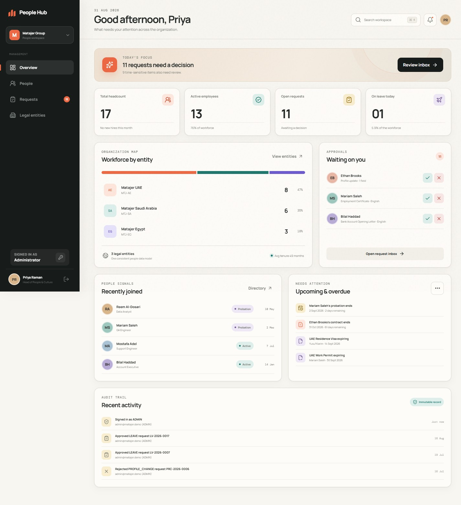

---

## The idea in one screenshot

Most HR systems treat country as a display field. Here `LegalEntity` **owns** the working
week, the public-holiday calendar, the currency, the probation length and the notice period.

So the same eight-day request costs a different number of days depending on who is asking —
and the employee is told exactly why before they commit:

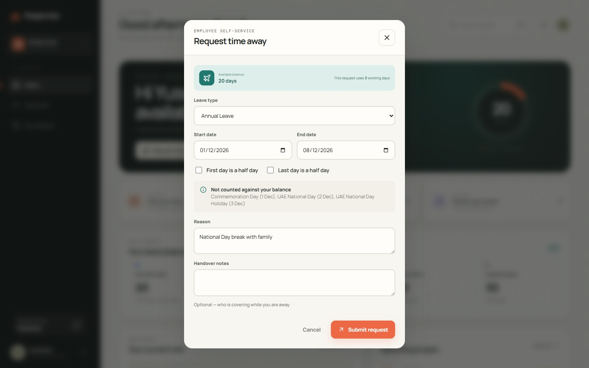

| Employee | Working week | Same 1–8 Dec range costs |
|---|---|---|
| **UAE** | Mon – Fri | **3 days** — three national holidays fall in range |
| **Saudi Arabia** | Sun – Thu | **6 days** — none in range |

That difference falls out of one `workWeek` column and the entity's holiday rows. There is
no country-specific branch anywhere in the request code. **Adding a fourth country is
inserting a row.**

---

## Two experiences, one system

<table>
<tr>
<td width="50%" valign="top">

### Management

Headcount, entity and department splits, a 12-month trend, and an alerts surface that answers
*what will bite me next month* — probation ending, contracts ending, visas expiring, requests
stale beyond five days.

</td>
<td width="50%" valign="top">

### Employee

Their own record, leave balances, and three self-service workflows that each run end to end:
submit → status → decision → visible effect. No emailing HR to ask where a request got to.

</td>
</tr>
</table>

### Directory — server-side search, filter, sort, pagination

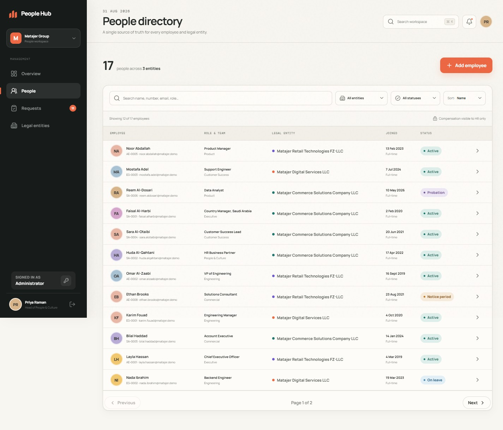

### One employee profile that brings the record together

Position, dated compensation history behind its own permission gate, leave balances,
documents and a full employment timeline — in one place, in the entity's own currency.

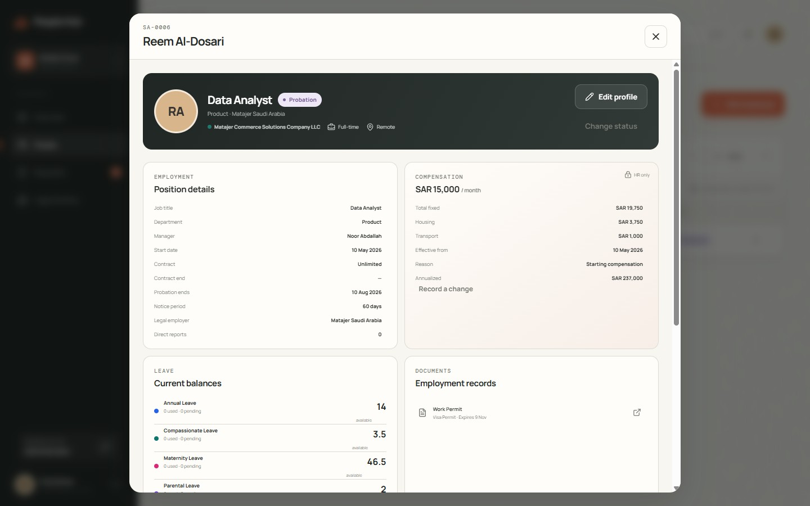

### One inbox for all three workflows

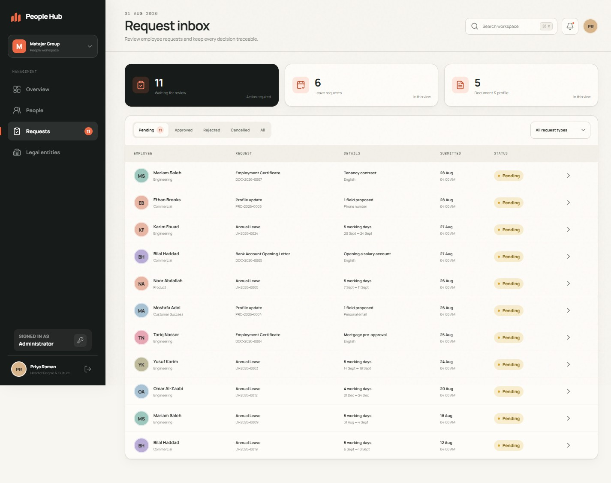

### The legal entity, made visible

Payroll is reported **per currency and never summed across them** — a single total across
AED, SAR and EGP would need an exchange rate the platform does not have, and inventing one
produces a number that looks authoritative and is wrong.

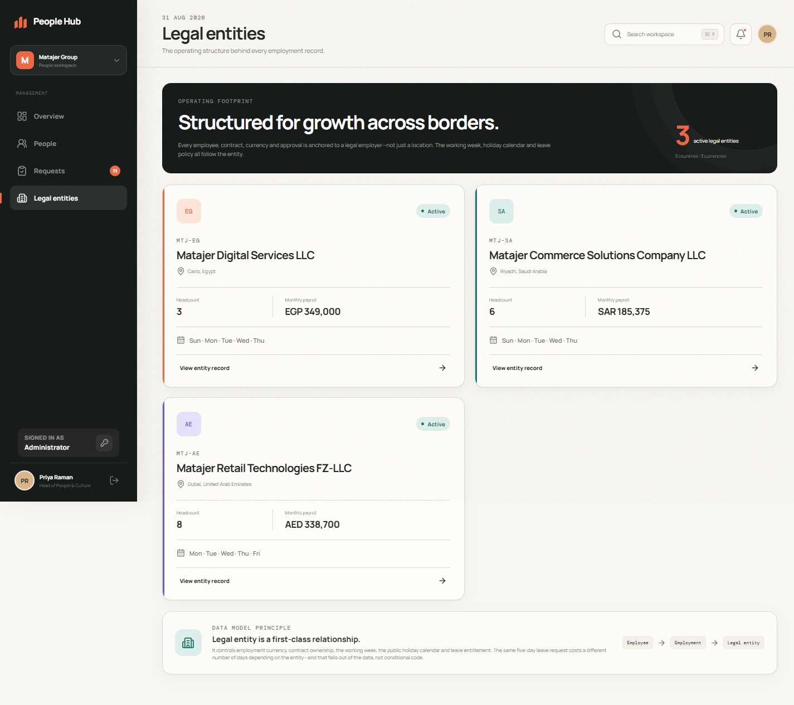

### Employee self-service

<table>
<tr>
<td width="50%" valign="top">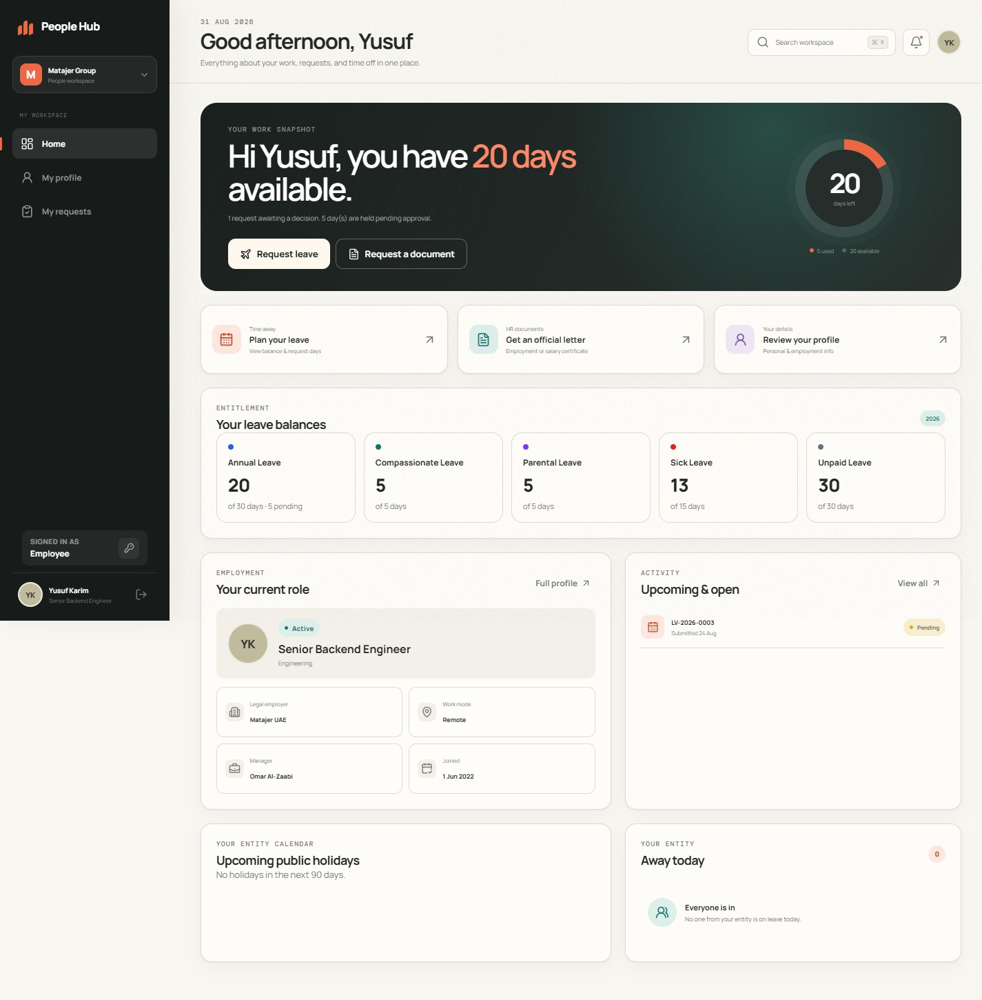</td>
<td width="50%" valign="top">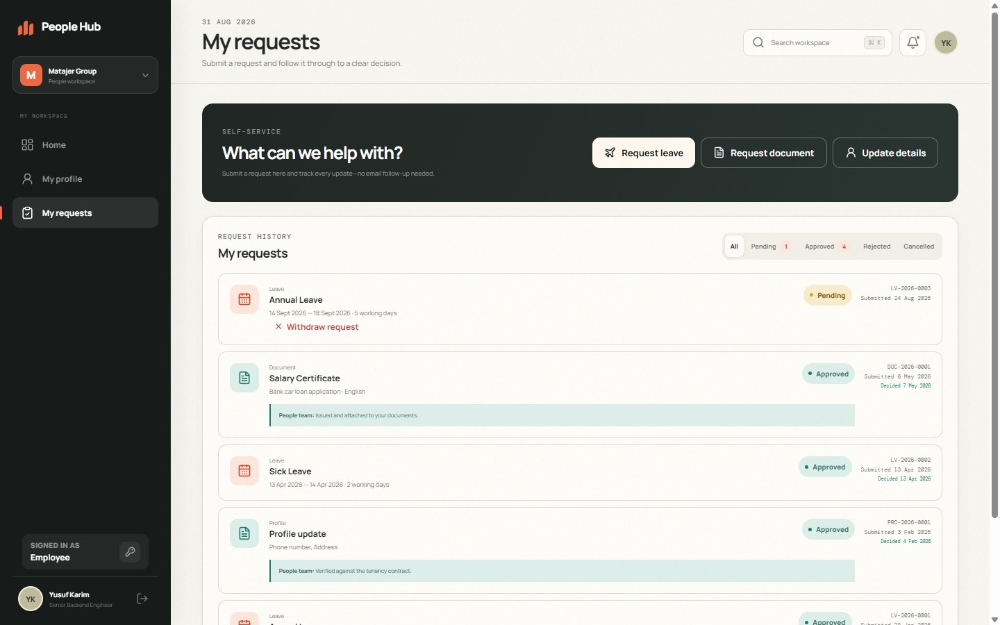</td>
</tr>
<tr>
<td align="center"><em>Balances, entitlements and what's open</em></td>
<td align="center"><em>Every request, its status and the decision note</em></td>
</tr>
</table>

### Line managers get their team — and never their team's pay

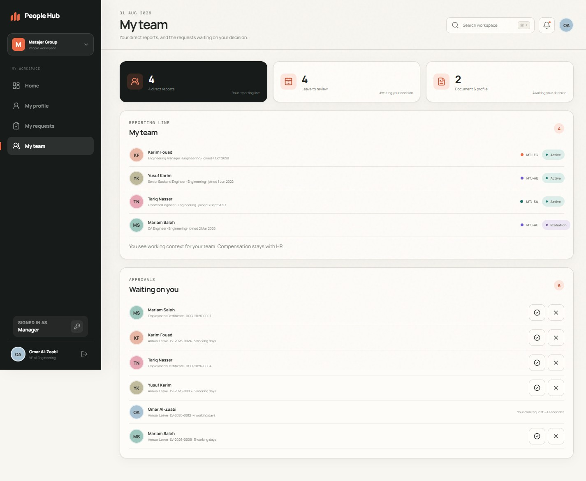

A manager approves for their team but cannot see a report's salary, and their own request is
shown as un-decidable rather than as a button that would be refused.

---

## The AI feature

Not required by the brief — the brief's AI budget is for *building* the product. This was
added because approving a document request used to create a record with no letter in it.

On approval, **Gemini 2.5 Flash** drafts the letter in English and Arabic from the employee's
real record:

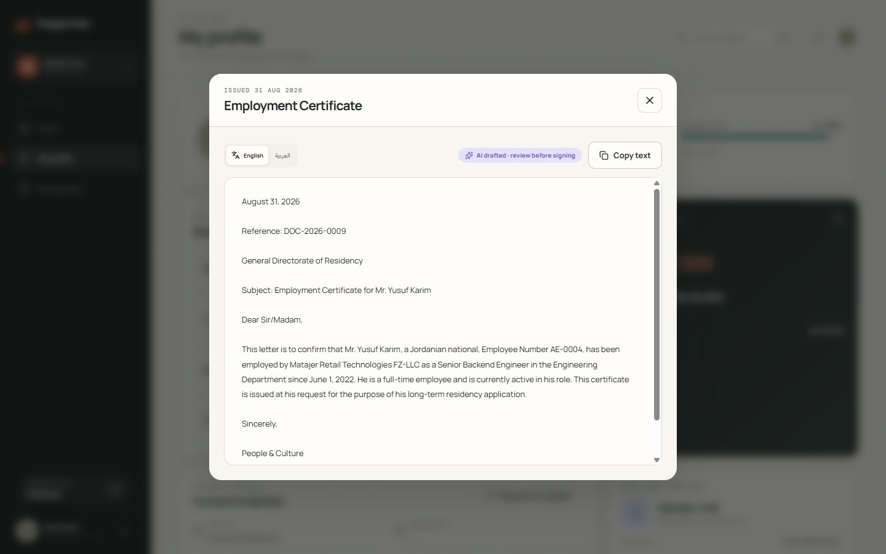

Three rules govern it:

1. **The template is the floor, the model is the ceiling.** Every letter type has a
   deterministic template that always produces a valid, signable letter. **With no
   `GOOGLE_API_KEY` the feature degrades to templates and the product works identically** —
   which is why the demo needs no credentials.
2. **The model never sees data the letter may not contain.** Salary reaches the prompt only
   when the employee asked for it to be stated. Nothing is redacted afterwards, because the
   sensitive value was never there.
3. **Facts come from the database, never the model.** Output is schema-constrained, and a
   second check rejects any draft introducing a monetary figure that was not authorised.

HR always sees whether a draft was machine-written before signing it — that's the badge in
the screenshot. Cost is about **a fifth of a cent per letter**, and **$0.00 as delivered**
since no key is configured on the deployment.

---

## Responsive, not merely resized

<table>
<tr>
<td width="50%" align="center">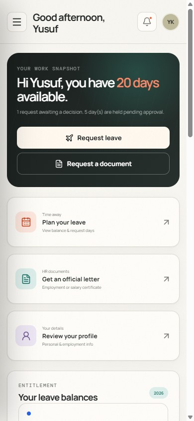</td>
<td width="50%" align="center">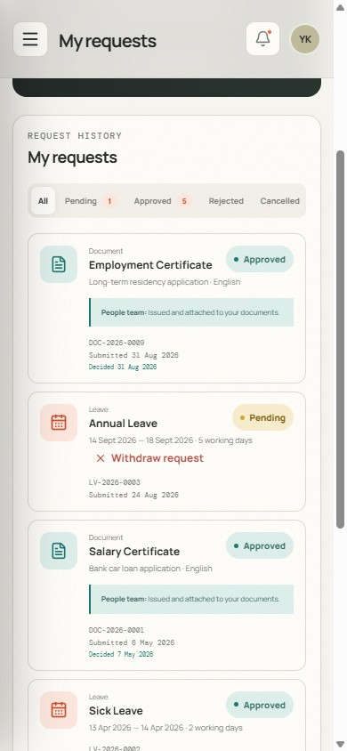</td>
</tr>
</table>

Tables become cards, the sidebar becomes a drawer, modals become sheets. Asserted at 390×844
in the acceptance suite: no horizontal overflow on any page, and every modal has a reachable
close path.

---

## Privacy is the part worth reviewing

Four roles — `ADMIN`, `HR_ADMIN` (scopable to one entity), `MANAGER`, `EMPLOYEE`. **Every
authorization decision is made by a function in one file**,
[`services/access.ts`](Employee%20Management%20Platform%20BackEnd/src/services/access.ts), so
the rules can be read in a sitting and tested directly.

| Rule | Why |
|---|---|
| A line manager **cannot** see a report's salary | They get the context to plan around their team; pay conversations belong to HR |
| Colleagues get an address book, not a wall | Name, title, department, work email — personal fields are **absent from the payload**, not null |
| Reading someone else's salary is **itself audited** | Who *looked* matters as much as who changed it. Reading your own is not logged |
| Nobody approves their own request — **including a global admin** | The four-eyes rule is what makes the audit trail mean anything |
| An unrelated request returns **404, not 403** | Confirming a reference exists is itself a leak |

Verified by 18 live IDOR/BOLA probes and 14 committed E2E cases — employees reaching for
colleagues' salaries, documents and requests; entity-scoped HR reaching across entities;
privileged fields smuggled through the profile-change endpoint; tampered and missing tokens.
Every one correctly refused.

---

## Demo accounts

Every seeded account uses **`Passw0rd!23`**. The login page has one-click fillers for Admin
and Employee.

| Role | Email | What it demonstrates |
|---|---|---|
| **Admin** | `admin@matajer.demo` | Everything, across all three legal entities |
| **Employee** | `employee@matajer.demo` | Self-service only |
| Scoped HR | `hr.ksa@matajer.demo` | Saudi entity **only** — proves the boundary is enforced |
| Manager | `manager@matajer.demo` | Team roster + approvals, **no** access to reports' pay |

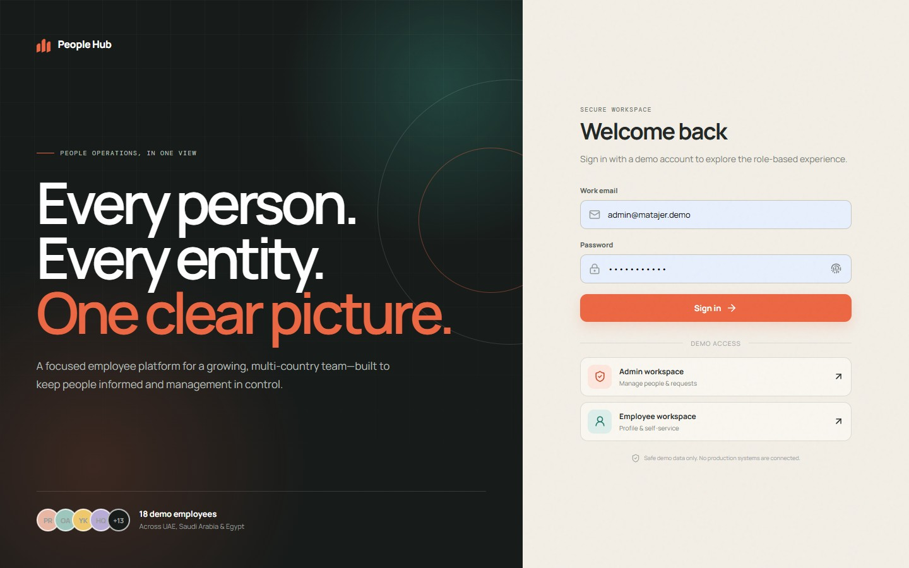

> **Two notes on the live demo.** Render's free tier sleeps after 15 minutes idle, so the
> first load can take **30–50 seconds** while the container wakes (measured 32.6s cold,
> 0.37s warm). And the deployed build may lag the latest commits — see
> [`FINAL-SUBMISSION.md`](FINAL-SUBMISSION.md).

---

## Tech stack

| Layer | Choice | Why |
|---|---|---|
| Frontend | React 19 + Vite | Fast, no framework ceremony for an SPA this size |
| API | Express 4 + TypeScript | Ordinary middleware and functions; no magic to explain |
| Database | PostgreSQL 17 + Prisma 6 | Deeply relational; constraints and transactions do real work |
| Validation | Zod | One schema per endpoint, types inferred from the same declaration |
| Auth | Backend-owned JWT + rotating refresh tokens | Rules live in code that can be read and tested, not vendor config |
| Tests | Vitest · Supertest · Playwright | Supertest mounts the real app; Playwright drives the real stack |

**Why not Supabase Auth or RLS?** RLS is strong, but it moves authorization into SQL
policies. When the privacy design is the thing being judged, having every rule in one
readable file with tests pointed at it is worth more — and it avoids coupling the product to
one vendor.

---

## Quick start

Requires Node 20+ and Docker.

```bash
cd "Employee Management Platform BackEnd" && npm install && cp .env.example .env && npm run db:up && npx prisma migrate deploy && npm run db:seed && npm run dev
```

```bash
cd "Employee Management Platform FrontEnd" && npm install && npm run dev
```

Open <http://localhost:5173>. The API is on `http://localhost:4000`, health at `/health`.
Vite proxies `/api`, so no frontend environment variable is needed locally.

<details>
<summary><strong>Running the tests</strong></summary>

```bash
cd "Employee Management Platform BackEnd" && npm run typecheck && npm test && npm run build
```

```bash
cd "Employee Management Platform FrontEnd" && npm test && npm run build
```

```bash
cd e2e && npm install && npx playwright install chromium && npm test
```

The E2E suite builds and seeds its own `ems_e2e` database and boots both servers itself, so
it never touches the demo data you are looking at. All three run in CI on every push.

</details>

---

## Testing

| Suite | Result |
|---|---|
| Backend integration — Vitest + Supertest against real PostgreSQL | **118 / 118** |
| Frontend unit — adapters, HTTP client, formatters | **34 / 34** |
| E2E acceptance — Playwright, real stack, 1440×900 + 390×844 | **38 / 38** |
| Typecheck · backend build · frontend production build | **clean** |
| Migrations + seed from an empty database | **verified** |

Beyond the automated suites: the UAE-vs-Saudi leave arithmetic was recounted independently
against each entity's own calendar, the AI letter path was exercised **both** with a live API
key and with it removed, and the production Docker image was built and run with
`NODE_ENV=production` against a fresh database.

Full requirement-by-requirement evidence — including the defects two acceptance passes found
and fixed — is in **[`docs/SPEC-COMPLIANCE.md`](docs/SPEC-COMPLIANCE.md)**.

---

## Architecture

```
Request
  ├─ helmet · cors · compression · body parsing
  ├─ requestId · structured logging · rate limiting
  ├─ authenticate      verifies the JWT, then re-reads the user every request
  ├─ controller        parses input with Zod, no business logic
  ├─ service           authorization, business rules, transactions
  ├─ serializer        decides which fields the caller may see
  └─ errorHandler      one place where an error becomes a response
```

Route-level role gates are coarse. The real decision is always made **per record** in the
service, because *"a manager may approve for their team but not for themselves"* cannot be
expressed as a role check on a URL.

<details>
<summary><strong>Data model — five decisions worth defending</strong></summary>

```
LegalEntity ──┬──< Employee >──── User            (1:1 optional — auth only)
              │       ├──< CompensationRecord     (dated history, own permission gate)
              │       ├──< EmploymentEvent        (hire, promotion, transfer, exit)
              │       ├──< Document               (expiry drives management alerts)
              │       ├──< LeaveBalance
              │       └──< Request ──┬── LeaveRequestDetail
              │                      ├── DocumentRequestDetail
              │                      └── ProfileChangeRequestDetail
              ├──< LeaveType         (entitlement differs per country)
              └──< Holiday           (public holidays differ per country)
```

1. **`LegalEntity` is the organisational root, and it carries policy** — working week,
   holidays, currency, probation, notice period.
2. **`User` and `Employee` are separate tables.** Not every employee needs a login, an HR
   admin need not be an employee, and an offboarded person keeps their record while losing
   access.
3. **Compensation lives in its own dated table**, so the default serializer *physically
   cannot* leak salary — and dated history comes free.
4. **Requests are one supertype plus typed detail tables**, so the admin inbox is a single
   indexed query while leave keeps real date columns for calendars and balance arithmetic.
5. **Current state is denormalised onto `Employee`, with events beside it** — avoiding the
   "which row is current" bug class while still producing a real timeline.

</details>

---

## Documentation

| Document | What it covers |
|---|---|
| [PRODUCT-SUMMARY.md](PRODUCT-SUMMARY.md) | What was built and the product decisions behind it |
| [Research and decisions](Employee%20Management%20Platform%20BackEnd/docs/research-and-decisions.md) | BambooHR, Deel/Rippling, Personio/Zoho — what was taken, what was deliberately *not* copied, MVP vs later |
| [docs/SPEC-COMPLIANCE.md](docs/SPEC-COMPLIANCE.md) | Every requirement, its evidence, its status |
| [AI-USAGE-LOG.md](AI-USAGE-LOG.md) | AI tools, what each did, and spend |
| [DEPLOYMENT.md](DEPLOYMENT.md) | Render + Neon, free tier, ~15 minutes |
| [Backend README](Employee%20Management%20Platform%20BackEnd/README.md) | Data model, permission matrix, full API reference |
| [FINAL-SUBMISSION.md](FINAL-SUBMISSION.md) | The submission message |

---

## Known limitations

Documents are metadata plus generated letter text — no binary upload or object storage yet ·
letters are stored as searchable text rather than rendered PDFs · public holidays are
illustrative, since Islamic dates move with lunar observation · the headcount trend is
computed in memory · rate limiting is in-process · the live Gemini call has no automated
test, by design, so the suites stay deterministic, offline and free.

Full list with impact in [`docs/SPEC-COMPLIANCE.md`](docs/SPEC-COMPLIANCE.md).

<div align="center">

---

Built for the Matajer AI product engineering assessment · demo data only, no real people

</div>
